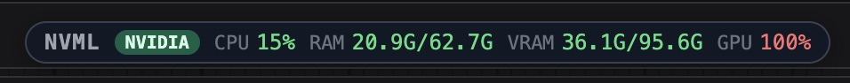
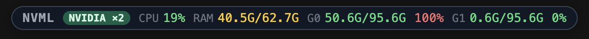

# ComfyUI-NVML-Monitor

> **NVIDIA-first hardware telemetry for ComfyUI** — a compact draggable chip plus a detailed popup, designed for Linux + Docker + remote workflows.


ComfyUI-NVML-Monitor is a lightweight ComfyUI extension that shows real-time GPU, CPU, and RAM telemetry without leaving the ComfyUI tab. It uses NVIDIA's NVML library directly (via `pynvml`/`nvidia-ml-py`), works seamlessly inside Docker containers, and correctly accounts for VRAM consumed by other containers or host processes that the in-container view normally hides.

<p align="center">
  
</p>

<p align="center">
  
</p>

The chip above is the always-on summary surface (CPU, RAM, VRAM, GPU util). On multi-GPU systems it auto-detects every card and labels them `G0`, `G1`, … with their own VRAM and util; the badge shows `NVIDIA ×N`. Click it to expand into a detailed popup with per-metric bars, temperature, power draw vs limit, clock speeds, fan, and a process table.

---

## Why this exists

There are existing ComfyUI monitors built around AMD's ADLX (Windows) and the broader XPUSYS-Monitor (cross-vendor). They are excellent in their respective lanes, but neither is the right fit when you are running ComfyUI on **Linux with NVIDIA**, often inside Docker, and sharing the GPU with other workloads (ollama, ffmpeg transcodes, other model servers).

This project is purpose-built for that environment:

- **NVIDIA-only path** — no provider abstraction, no AMD/Intel fallbacks. Just pynvml.
- **Docker-aware** — when the container can't see other processes on the GPU, it surfaces an explicit "External (other containers / host)" row so the missing VRAM is never mysterious.
- **Compact + draggable** — one chip in the corner, click to expand, drag anywhere, position remembered per browser.
- **No build step** — pure Python backend, vanilla JS frontend. Drop it in `custom_nodes/`, restart ComfyUI, done.

If you are on Windows with an AMD card, use [ComfyUI-ADLX-Monitor](https://github.com/zvonac99/ComfyUI-ADLX-Monitor). If you want a generalist solution that tries to cover everything, see the upstream [ComfyUI-XPUSYS-Monitor](https://github.com/allanmeng/ComfyUI-XPUSYS-Monitor).

---

## Features

### Top-bar chip

The chip floats above the ComfyUI canvas and shows, from left to right:

- `NVML` — plugin label
- `NVIDIA` — provider badge (red `offline` if NVML init fails; appends `×N` when multiple GPUs are detected)
- CPU usage percent
- System RAM `used / total`
- VRAM `used / total` (or per-GPU `G0`, `G1`, … blocks on multi-GPU systems)
- GPU utilization percent

Color coding:

| Value | < 60 | 60 – 85 | ≥ 85 |
|-------|------|---------|------|
| CPU / RAM / VRAM / GPU util | green | yellow | red |
| Temperature | < 65 °C green | 65 – 82 °C yellow | ≥ 82 °C red |
| Power draw vs limit | < 70 % green | 70 – 90 % yellow | ≥ 90 % red |

### Popup — GPU tab

Click the chip to open a popup with two tabs. The GPU tab shows, per detected device:

- **GPU util** — utilization bar + percent
- **VRAM** — usage bar + `used / total` + percent
- **Mem ctrl util** — memory controller utilization (different from VRAM fullness; this is bus saturation)
- **Temperature** — color-coded
- **Power** — current draw + limit (with a bar relative to the limit; especially useful on high-TDP cards like the 600 W RTX PRO 6000 Blackwell)
- **Clocks** — graphics MHz and memory MHz
- **Fan** — percent
- **Processes** — PID, name, VRAM per process, plus an `External` row when in-container VRAM accounting does not match the global NVML total

### Popup — System tab

- **CPU total load** — percent + bar
- **Per-core grid** — one mini-bar per logical core, useful for spotting an unevenly threaded workload
- **RAM** — used / total + bar
- **Driver** — NVIDIA driver version
- **Provider** — `NVIDIA` or `unavailable` (with the underlying NVML error if init failed)

### Quality-of-life

- **Draggable chip** — click and drag anywhere on screen
- **Position persistence** — saved per origin to `localStorage` (`nvml_monitor.pos`)
- **Popup persistence** — if the popup was open when the page was last unloaded, it reopens automatically (`nvml_monitor.popup_open`)
- **Cached endpoint** — the backend collector caches NVML reads for 500 ms; concurrent polls from multiple tabs are coalesced

---

## Installation

### Option A — ComfyUI Manager (recommended once registered)

Open ComfyUI Manager → *Install via Git URL* → paste:

```
https://github.com/robomello/ComfyUI-NVML-Monitor
```

Restart ComfyUI.

### Option B — Manual

```bash
cd /path/to/ComfyUI/custom_nodes
git clone https://github.com/robomello/ComfyUI-NVML-Monitor
cd ComfyUI-NVML-Monitor
pip install -r requirements.txt
```

Then restart ComfyUI.

### Dependencies

- `nvidia-ml-py` (formerly `pynvml`) — NVIDIA's official NVML bindings
- `psutil` — cross-platform process and system stats

Both are typically already installed in modern ComfyUI Docker images (`comfyui:local`, `comfyanonymous/ComfyUI`, etc.). They are listed in `requirements.txt` for completeness.

### Requirements

- NVIDIA GPU with a driver new enough to expose the metrics you care about (any modern driver, e.g. 535+, covers everything used here)
- ComfyUI running on Linux or Windows
- Python 3.10 or newer (ComfyUI's own requirement)

---

## Usage

After install + restart, the chip appears top-right. Drag it where you want; the position is saved per browser. Click it to open the popup; click it again, press the `×`, or reload to close.

There is no configuration UI yet. Settings that exist live in `localStorage`:

| Key | Type | Purpose |
|-----|------|---------|
| `nvml_monitor.pos` | `{x:number,y:number}` | chip position |
| `nvml_monitor.popup_open` | `"0"` or `"1"` | last popup state |

The polling interval and cache TTL are constants at the top of `web/nvml_monitor.js` (`POLL_MS = 1500`) and `monitor.py` (`_CACHE_TTL = 0.5`). Edit and restart ComfyUI to change.

---

## HTTP API

The custom node exposes one endpoint on the ComfyUI server.

### `GET /nvml_monitor/stats`

Returns the current snapshot as JSON. Cached server-side for 500 ms.

**Example response** (RTX PRO 6000 Blackwell, mostly idle, with ollama loaded on the GPU):

```json
{
  "ts": 1779495383.43,
  "provider": "NVIDIA",
  "driver": "595.58.03",
  "nvml_error": null,
  "cpu": {
    "percent": 9.6,
    "cores": [36.9, 10.0, 18.6, 8.6, 17.7, 13.7, 2.8, 2.3, 2.4, 2.8, 2.6, 3.2,
              10.5, 8.9, 26.8, 8.1, 26.0, 13.6, 2.8, 2.5, 2.6, 2.9, 3.0, 3.6],
    "count": 24
  },
  "ram": {
    "used_gb": 19.06,
    "total_gb": 62.72,
    "percent": 30.4
  },
  "gpus": [
    {
      "index": 0,
      "name": "NVIDIA RTX PRO 6000 Blackwell Workstation Edition",
      "vram": {"used_gb": 90.33, "total_gb": 95.59, "free_gb": 5.26, "percent": 94.5},
      "util": {"gpu": 92, "memory": 0},
      "temp_c": 32,
      "power": {"draw_w": 91.9, "limit_w": 600.0},
      "clocks": {"graphics_mhz": 1845, "memory_mhz": 9501},
      "fan_percent": 30,
      "processes": [
        {"pid": 1, "name": "python", "mem_mb": 662.0}
      ],
      "external_mb": 91805.2
    }
  ]
}
```

### Field reference

| Field | Meaning |
|-------|---------|
| `ts` | Unix timestamp when this snapshot was taken (server clock) |
| `provider` | `"NVIDIA"` or `"unavailable"` |
| `driver` | NVIDIA driver version string |
| `nvml_error` | `null` if NVML initialized; otherwise `"<ErrorType>: <message>"` |
| `cpu.percent` | total CPU utilization, 0 – 100 |
| `cpu.cores[]` | per-logical-core utilization |
| `cpu.count` | number of logical cores |
| `ram.used_gb` / `total_gb` / `percent` | system RAM stats |
| `gpus[]` | one entry per detected NVIDIA GPU |
| `gpus[i].vram.percent` | `used / total * 100`, computed once on the server for consistency |
| `gpus[i].util.gpu` / `util.memory` | NVML `UtilizationRates` (GPU compute and memory controller) |
| `gpus[i].temp_c` | core temperature |
| `gpus[i].power.draw_w` / `limit_w` | current draw and management limit, watts |
| `gpus[i].clocks.graphics_mhz` / `memory_mhz` | clock speeds |
| `gpus[i].fan_percent` | fan duty cycle, where applicable |
| `gpus[i].processes[]` | compute processes visible to NVML *from inside ComfyUI's process namespace* |
| `gpus[i].external_mb` | `total_used - sum(processes.mem_mb)` in MB — explained below |

---

## The "External" row — Docker / namespace caveat

When ComfyUI runs inside a Docker container, NVML can see the **device-level** state perfectly: total VRAM, total utilization, temperature, power, clocks — all of it. But `nvmlDeviceGetComputeRunningProcesses()` returns PIDs from the **host's** PID namespace, while `psutil.Process(pid).name()` inside the container can only resolve PIDs in the **container's** namespace.

The practical effect: a host-side `nvidia-smi` might show nine processes spread across multiple containers, while the in-container ComfyUI sees only its own. The VRAM totals still match, but the per-process breakdown looks like there is a huge unaccounted gap.

This extension closes that gap by computing:

```
external_mb = max(0, total_used_mb - sum(visible_processes.mem_mb))
```

and showing it as a single `External (other containers / host)` row in the Processes table whenever it exceeds 100 MB. You still cannot tell *which* external process is using the VRAM — that requires a host-side query — but you at least see that it exists and how much.

If you run ComfyUI bare-metal (not in Docker), `external_mb` will typically be near zero unless other host processes are also using the GPU.

---

## Architecture

```
ComfyUI-NVML-Monitor/
├── __init__.py            # ComfyUI entry point, registers /nvml_monitor/stats
├── monitor.py             # NVML + psutil collector, 500 ms cache, thread-safe
├── requirements.txt
├── LICENSE
├── README.md
└── web/
    └── nvml_monitor.js    # Frontend: chip, popup, polling, styles, persistence
```

### Backend (`monitor.py`)

- Single function `collect()` returns the full snapshot dict
- NVML init is lazy and cached; once initialized, GPU handles are held for the process lifetime
- Errors during init are captured in `nvml_error` rather than raised (the extension still works for CPU/RAM)
- Individual NVML calls are wrapped in `_safe()` so a single unsupported metric (e.g., fan on a card without one) does not break the rest
- Process listing is capped at 10 entries; each tries `psutil.Process(pid).name()` and falls back to `"unknown"`

### Frontend (`web/nvml_monitor.js`)

- Registered as a ComfyUI extension via `app.registerExtension`
- No framework, no build step — vanilla JS + inline styles in a single file
- The chip is a `position: fixed` div appended to `document.body` with a small drag implementation (click without movement opens the popup; click-and-drag moves the chip)
- The popup is created/destroyed on demand and re-renders on each poll while open
- All UI strings, colors, and thresholds are local constants — easy to fork and rebrand

### Why an HTTP endpoint and not a WebSocket?

NVML polling is cheap (sub-millisecond per call for the metrics used here), and ComfyUI's existing WebSocket carries queue / progress events. A small REST endpoint cached at 500 ms keeps the implementation simple, decouples the lifecycle of the monitor from the prompt server, and lets you `curl` the endpoint for scripting (alerting, dashboards, log scraping).

---

## Tested configuration

The author runs this on:

- **GPU:** NVIDIA RTX PRO 6000 Blackwell Workstation Edition (97 GB VRAM, 600 W TDP)
- **Driver:** 595.58.03
- **OS:** Linux 6.17 (host) running ComfyUI in a Docker container with `--gpus all`
- **ComfyUI image:** custom `comfyui:local`
- **Browser:** Chromium-based, accessing ComfyUI through Cloudflare Tunnel

It should work on any NVIDIA GPU with a modern driver. Multi-GPU is supported on the backend (one `gpus[]` entry per device); the chip currently shows GPU 0 only in its summary, but the popup iterates all devices.

It has not been formally tested on:

- Windows hosts
- Bare-metal (non-Docker) ComfyUI installs
- Very old driver versions
- Datacenter GPUs (Hopper, etc.)

If you run it on any of those, PRs / issues with results are welcome.

---

## Troubleshooting

### The chip does not appear

1. Hard-refresh the browser (Ctrl/Cmd + Shift + R) — ComfyUI caches extension JS aggressively.
2. Open DevTools and look in the *Network* tab for `/extensions/ComfyUI-NVML-Monitor/nvml_monitor.js`. It should be a 200.
3. Check ComfyUI's console / Docker logs for `/app/custom_nodes/ComfyUI-NVML-Monitor` — if it failed to load, you will see `IMPORT FAILED` next to that path.
4. Check `pip show nvidia-ml-py psutil` inside the ComfyUI environment.

### The chip shows `NVML offline`

The backend returned `provider: "unavailable"` (or the endpoint did not respond). Hit `/nvml_monitor/stats` directly and look at `nvml_error`. Common causes:

- Container started without `--gpus`/`--runtime=nvidia` — fix the Docker run / compose
- Driver version too old for `nvidia-ml-py` — update the driver or pin an older `nvidia-ml-py`
- NVML library mismatch (very rare on stock images)

### Processes list is shorter than `nvidia-smi`

Expected inside a container — see [The "External" row](#the-external-row--docker--namespace-caveat) above.

---

## Roadmap

Not promises, just things considered:

- Settings panel inside ComfyUI (poll interval, thresholds, which metrics to show)
- Sparkline / history mode (e.g. last 60 s of VRAM and util in the popup)
- Threshold alerts (toast when temp > N, or VRAM > N %)
- Optional per-GPU chip when more than one device is present
- Optional integration with ComfyUI's queue events to flash the chip while a workflow is running

---

## Acknowledgments

This project's UI shape (compact chip + tabbed popup) is directly inspired by:

- [ComfyUI-ADLX-Monitor](https://github.com/zvonac99/ComfyUI-ADLX-Monitor) — AMD-focused fork
- [ComfyUI-XPUSYS-Monitor](https://github.com/allanmeng/ComfyUI-XPUSYS-Monitor) — multi-vendor upstream

The Python implementation, the API surface, and the Docker / namespace handling are independent.

### Built with

This project was designed and implemented in pair-programming sessions with [Claude Code](https://www.anthropic.com/claude-code) (Anthropic). Code, README, packaging, and the registry submission were generated collaboratively. Author retains full responsibility for the final result.

See [`CONTRIBUTORS.md`](CONTRIBUTORS.md) for the full list of contributors.

---

## License

MIT. See [`LICENSE`](LICENSE).

---

## Changelog

### 0.1.0 — initial release

- Floating chip with CPU / RAM / VRAM / GPU util
- Popup with GPU and System tabs
- `/nvml_monitor/stats` HTTP endpoint
- Docker-aware `external_mb` accounting
- 500 ms server cache, 1500 ms client poll
- Position + popup state persistence
